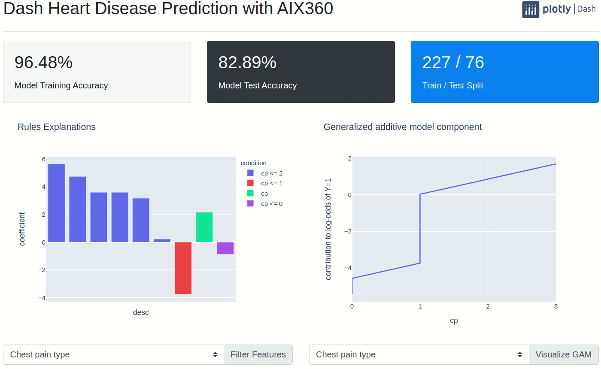

This app shows you how to visualize and analyze explainable AI (xAI) models with [Dash](https://plotly.com/dash/) and [IBM's AI Explainability 360 (AIX360)](https://aix360.mybluemix.net/). It uses a [LogisticRuleRegression](https://aix360.readthedocs.io/en/latest/dise.html#aix360.algorithms.rbm.logistic_regression.LogisticRuleRegression) model trained on the [UCI Heart Disease data set](https://archive.ics.uci.edu/ml/datasets/heart+Disease) for predicting the presence of heart disease in Cleveland patients.

The model we showcase is not only accurate, but it also lets you compute the [coefficient of each rule](https://aix360.readthedocs.io/en/latest/dise.html#aix360.algorithms.rbm.logistic_regression.LogisticRuleRegression.explain), which is the combination of various conditions of the patient. Furthermore, you can also [visualize](https://aix360.readthedocs.io/en/latest/dise.html#aix360.algorithms.rbm.logistic_regression.LogisticRuleRegression.visualize) the generalized additive model component of each patient attribute. According to the docs, the latter *" includes first-degree rules and linear functions of unbinarized ordinal features but excludes higher-degree rules."*